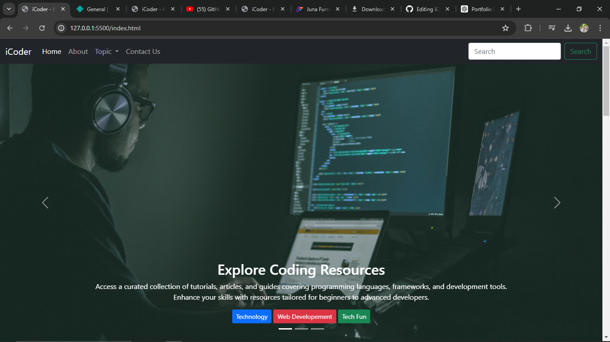
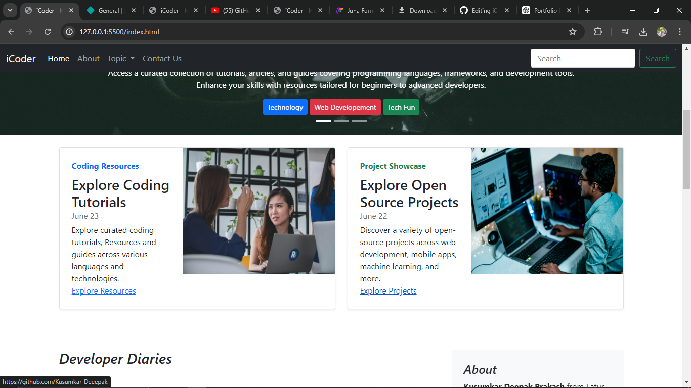
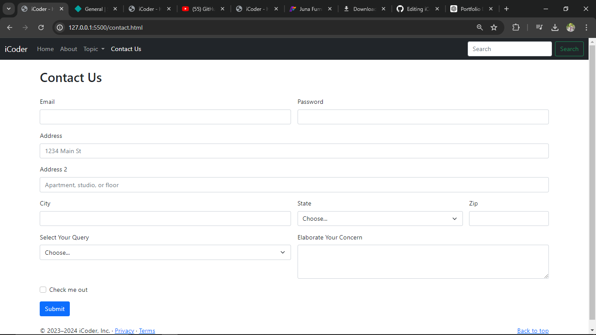
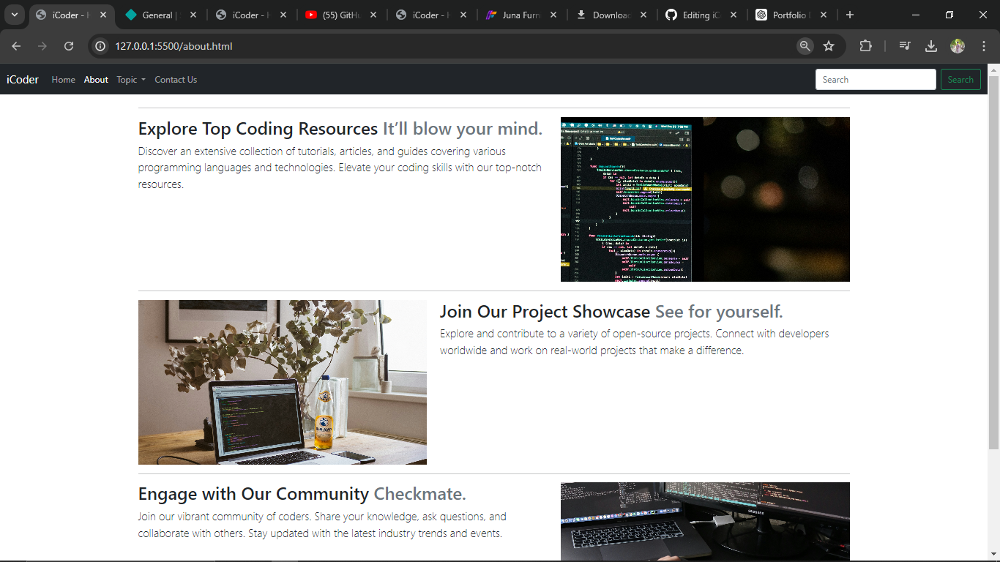

# iCoder Website

Welcome to the iCoder project repository! This project showcases a website built with HTML, CSS, and Bootstrap 5 framework.

## Table of Contents

- [Description](#description)
- [Features](#features)
- [Screenshots](#screenshots)
- [Installation](#installation)
- [Usage](#usage)
- [Contributing](#contributing)
- [License](#license)

## Description

The iCoder website is a platform aimed at programmers and developers looking to enhance their skills and knowledge. It offers curated coding resources, tutorials, and open-source projects across various domains like technology, web development, and more.

## Features

- Responsive design using Bootstrap 5 framework.
- Navigation bar with dropdown menus for easy navigation.
- Carousel slider with engaging captions and buttons.
- Blog section featuring articles on coding, web development, and JavaScript frameworks.
- Contact form for user inquiries and feedback.

## Screenshots

Here are some screenshots of the iCoder platform. If the images are not displaying, please check the `Screenshots` folder in the repository.

### Screenshot 1
 - 

### Screenshot 2


### Screenshot 3


### Screenshot 4



## Installation

To run this project locally, follow these steps:

1. Clone the repository:
   ```bash
   git clone https://github.com/your-username/iCoder-Website.git
